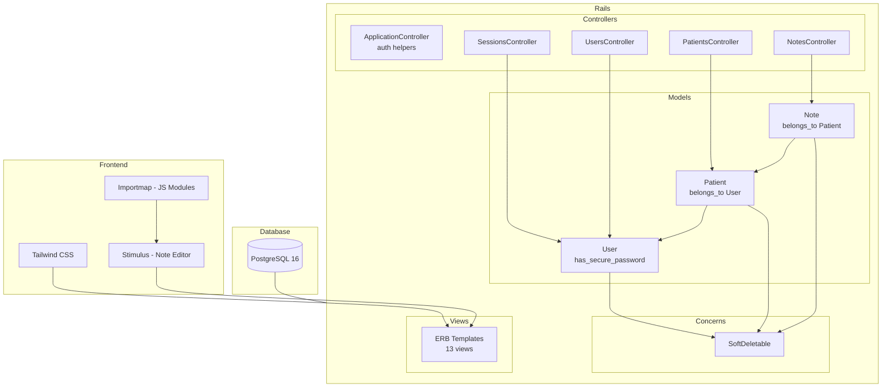
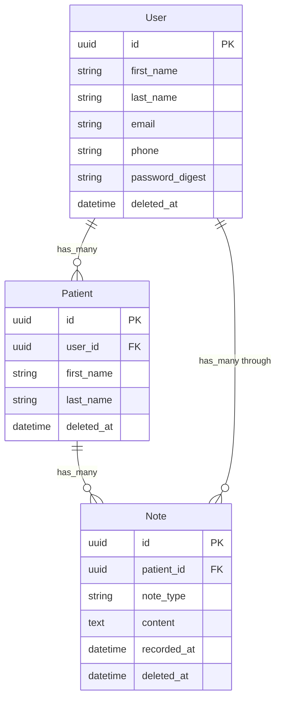

# Psicolog

Aplicación web para gestión de pacientes y notas clínicas para profesionales de psicología. MVP con autenticación simple, CRUD de pacientes y notas, editor WYSIWYG, vista de resumen pre-sesión, y filtros.

## Features

| Feature | Descripción |
|---|---|
| 🔐 Autenticación | Login/logout/signup con `has_secure_password`, sesión por cookie, sin refresh tokens |
| 👥 Pacientes | CRUD completo con scoping por profesional (cada psicólogo ve solo sus pacientes) |
| 📝 Notas | CRUD anidado bajo pacientes, editor WYSIWYG con toolbar (bold, italic, listas, quick note) |
| 📋 Session Summary | Vista de resumen pre-sesión con últimas 5 notas + datos del paciente |
| 🔍 Filtros | Búsqueda por nombre en pacientes y por contenido/tipo en notas (Ransack) |
| 🗄️ Soft Delete | Borrado lógico en los 3 modelos vía concern `SoftDeletable` |
| 🌐 i18n | Interfaz completa en español rioplatense, tipos de nota traducidos, timezone Buenos Aires |
| 🎨 UI | Diseño editorial con Tailwind CSS, Helvetica Neue, paleta celeste, responsive |

## Arquitectura



### Modelos



## Stack técnico

| Capa | Tecnología |
|---|---|
| Backend | Ruby 3.3.11, Rails 7.2 |
| Base de datos | PostgreSQL 16 (pgcrypto para UUIDs) |
| Frontend | Tailwind CSS (CDN), Stimulus, Importmap, ERB |
| Auth | `has_secure_password` + bcrypt |
| Filtros | Ransack 4.4 |
| Rich text | `contenteditable` + `execCommand` (WYSIWYG nativo) |
| Infraestructura | Docker Compose (2 servicios: db + web) |
| CI/CD | GitHub Actions |
| Linter | RuboCop (Omakase Rails) |
| Tests | Minitest |

## Usuarios de prueba

Al levantar el contenedor por primera vez, la DB se puebla automáticamente con datos de prueba.

| Email | Nombre | Contraseña |
|---|---|---|
| axel@psicolog.com | Axel Mrak | `password123` |
| julian@psicolog.com | Julián Fernández | `password123` |
| andres@psicolog.com | Andrés Giménez | `password123` |

Cada usuario tiene entre 3 y 5 pacientes asignados, y ~25 notas clínicas en español rioplatense cubriendo todos los tipos (nota de sesión, entrevista inicial, seguimiento, emergencia, alta, nota general, nota rápida).

## Inicio rápido

### Requisitos

- Docker Desktop (o Docker Engine + Compose plugin)

### Setup inicial

```bash
git clone <repo-url>
cd psicolog
cp .env.example .env
```

### Iniciar

```bash
docker compose up -d --build --remove-orphans
```

La app queda disponible en **[http://localhost:3000](http://localhost:3000)**.

En el primer arranque, el entrypoint del contenedor ejecuta `db:prepare`, que:
1. Crea la base de datos si no existe
2. Corre las migraciones pendientes
3. Ejecuta `db:seed` si la DB está vacía

Los seeds no se ejecutan en entorno de test para no contaminar la suite.

### Desarrollo local (DB en Docker, Rails en host)

```bash
docker compose up -d db      # solo PostgreSQL
bundle install
rails db:migrate
rails server
```

## Tests

```bash
# suite completa
docker compose exec web ./bin/rails test

# archivo específico
docker compose exec web ./bin/rails test test/models/user_test.rb
```

36 tests, 58 assertions, 0 failures.

## Comandos útiles

```bash
# estado de los servicios
docker compose ps

# logs
docker compose logs -f web

# consola Rails
docker compose exec web ./bin/rails console

# correr migraciones
docker compose exec web ./bin/rails db:migrate

# re-poblar seeds (borra datos existentes)
docker compose exec web ./bin/rails db:seed:replant

# detener
docker compose down
```

## Hot reload

El código fuente se monta como volumen (`.:/rails`). Zeitwerk recarga automáticamente:

| Recurso | Comportamiento |
|---|---|
| Modelos, controladores | Recarga en cada request |
| Vistas (`.html.erb`) | Recarga en cada request |
| `config/routes.rb` | Recarga en cada request |
| `config/application.rb` | Requiere restart |
| `config/database.yml` | Requiere restart |
| Nuevas gems (`Gemfile`) | Requiere rebuild: `docker compose up -d --build` |

## CI/CD

GitHub Actions ejecuta en cada push y PR a `dev`/`main`:

- Build del contenedor Docker
- Smoke check: `curl` al endpoint `/up`
- Suite de tests

Usa `.env.example` vía `APP_ENV_FILE=.env.example` para el entorno de CI.

## Estructura del proyecto

```
├── app/
│   ├── controllers/
│   │   ├── application_controller.rb   # auth helpers
│   │   ├── sessions_controller.rb      # login/logout
│   │   ├── users_controller.rb         # signup
│   │   ├── patients_controller.rb      # CRUD + summary
│   │   └── notes_controller.rb         # CRUD anidado
│   ├── models/
│   │   ├── concerns/soft_deletable.rb  # soft delete mixin
│   │   ├── user.rb
│   │   ├── patient.rb
│   │   └── note.rb
│   ├── views/
│   │   ├── layouts/application.html.erb
│   │   ├── sessions/new.html.erb
│   │   ├── users/new.html.erb
│   │   ├── shared/_flash.html.erb
│   │   ├── patients/ (index, show, new, edit, _form, summary)
│   │   └── notes/ (index, show, new, edit, _form)
│   └── javascript/
│       └── controllers/note_editor_controller.js
├── db/
│   ├── migrate/
│   └── seeds.rb
├── config/
│   ├── routes.rb
│   ├── importmap.rb
│   └── locales/es.yml
├── Dockerfile
├── docker-compose.yml
└── .github/workflows/ci.yml
```
